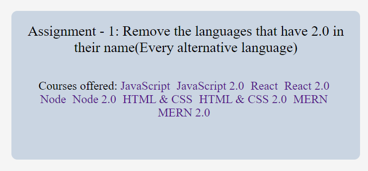

# Project 7

## Original Output Image




## Task 1: Achieve the following Output using JavaScript DOM Manipulation


## JavaScript Code:

```js
const languages = document.querySelectorAll('.main__languages a');

languages.forEach((language) => {
  if (language.innerText.includes('2.0')) {
    let storedValues = language;
    console.log(storedValues);
    storedValues.style.display = 'none';
  }
});
```

---

---


## Task 2: Achieve the following Output using JavaScript DOM Manipulation


## JavaScript Code:

```js
let targetPlaceholder = document.querySelector('input.main__form-input');
console.log(targetPlaceholder);
targetPlaceholder.placeholder = 'iNeuron';

let form = document.querySelector('form');
let input = document.querySelector('input');
input.removeAttribute('disabled');
let submitButton = document.querySelector('button.main__form-btn');
submitButton.removeAttribute('disabled');
form.addEventListener('submit', (e) => {
  e.preventDefault();
  let inputValue = input.value;
  console.log(inputValue);
  let languageSection = document.querySelector('.main__languages');
  let createAnchorTag = document.createElement('a');
  let createAttribute = document.createAttribute('href');
  createAttribute.value = 'https://www.ineuron.ai';
  createAnchorTag.setAttributeNode(createAttribute);
  createAnchorTag.innerText = inputValue;
  languageSection.appendChild(createAnchorTag);
});
```
