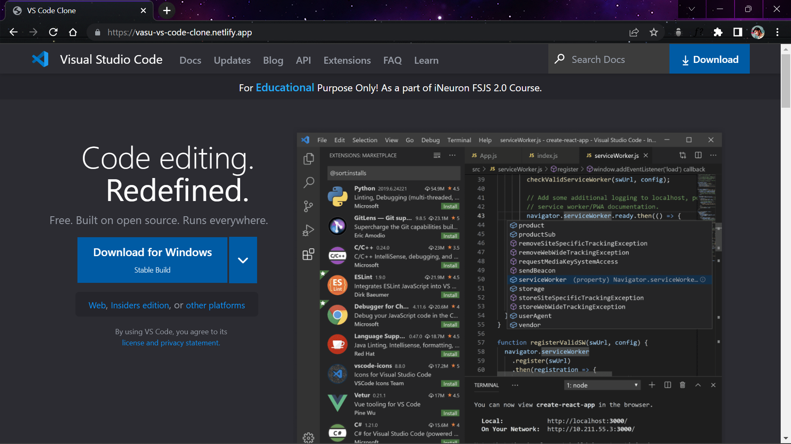

# Visual Studio Code Website Landing Page Clone

Visual Studio Code Website Landing Page Cloned using **Tailwind CSS** as part of **[iNeuron](https://ineuron.ai/ 'iNeuron')** assignment.

### Skills Gained :

- Learnt about **Tailwind CSS** Classes
- To Make Websites Faster Using **Tailwind CSS**
- To Use **Tailwind CSS** Utility Classes
- Got an Idea on **Tailwind CSS** Core Concepts

### Output :

